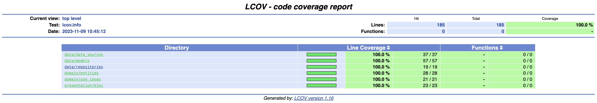

# Mobile Engineer test #1

Test for Mobile Engineering positions at CloudWalk.

## Information

The project has only been tested on physical iOS devices. I currently don't have any Android devices available.

## Considerations

- Initially I had planned to make 2 features, one to list the shows and another to present the forecast. Although
as one of the requirements is to work offline, I chose to fetch all the data at once. This way the app only
it would need a single charge to work. As a result, I chose to focus on a single feature.

## Improvements

- Use a string generator so that the texts are not hard coded.

## Commands

- <code>make flutter_setup</code> -> cleans and downloads project packages;

- <code>make run_debug</code> -> runs the project in debug mode;;

- <code>make run_release</code> -> runs the project in release mode;

- <code>make app_coverage</code> -> runs the tests and generates a coverage report;

- <code>make build_runner</code> -> runs the build_runner package to regenerate the necessary files;

> You may need to install the make package to run the commands -> <code>brew install make</code>

## Installation

1. Execute the command <code>make flutter_setup</code>
2. Execute the command <code>make run_release;</code>

## Test Coverage

- To generate the report, execute the command <code>make app_coverage</code>.

